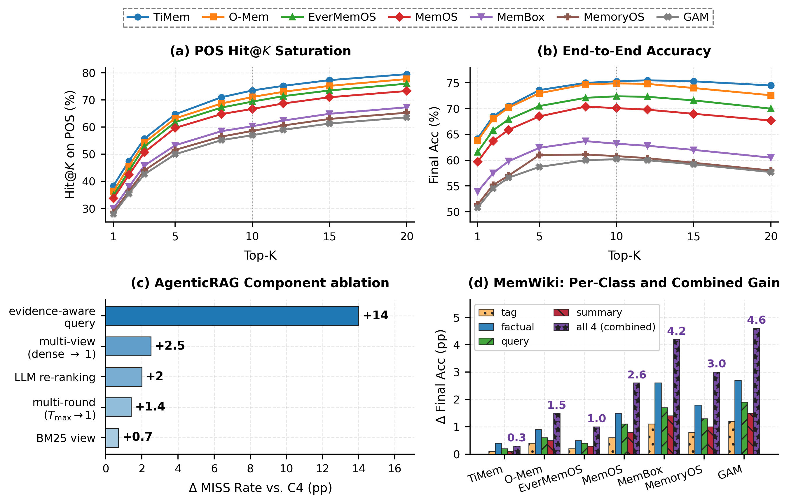

# EvalMem

<p align="center">
  <a href="#"></a>
  <a href="LICENSE"></a>
  
  
</p>

> **EvalMem: An Operation-Level Diagnostic Framework for Long-Term Memory Systems**
> Anonymous repository accompanying the EMNLP 2026 submission.

Long-horizon LLM assistants are usually scored by end-to-end QA accuracy, so a wrong answer hides *why* it was wrong — the system may have failed to **store** the fact, failed to **retrieve** it, or failed to **use** it. EvalMem replaces black-box scoring with **operation-level attribution**: for every query, three independent **Examiners** run in parallel and their per-sample defect subsets are unioned into a multi-label diagnosis over an **11-code taxonomy** spanning encoding, retrieval, and generation.

Across seven released memory systems on **LoCoMo**, **LongMemEval-S**, and our dynamic benchmark **DynaMem-Bench**, EvalMem identifies **retrieval as the dominant bottleneck** (e.g. 22.1% retrieval vs. 7.7% encoding vs. 6.5% generation defects on the default LoCoMo setting).

## Overview

| Examiner | Inputs | Question it answers |
|---|---|---|
| **Encoding** $\mathcal{E}_{\text{enc}}$ | $(Q, \tau, F_{\text{key}}, \mathcal{M})$ | Is the information required by $Q$ actually present in the memory store $\mathcal{M}$? |
| **Retrieval** $\mathcal{E}_{\text{ret}}$ | $(Q, \tau, F_{\text{key}}, C_{\text{original}})$ | Does native retrieval surface that information in an effective context? |
| **Generation** $\mathcal{E}_{\text{gen}}$ | $(Q, \tau, C_{\text{oracle}})$ | Given a perfect oracle context, can the LLM answer correctly? |

Here $Q$ is the query, $\tau \in \{\text{POS}, \text{NEG}\}$ is the task type, $F_{\text{key}}$ the annotated key facts, $\mathcal{M}$ the system's full memory export, $C_{\text{original}}$ its native top-$K$ context, and $C_{\text{oracle}}$ the gold evidence. An Attribution Agent reconciles the three subsets into a multi-label diagnosis, suppressing downstream defects that merely follow from upstream failures (the *causal shield*). The overall architecture is in [`assets/figures/framework.pdf`](assets/figures/framework.pdf); the pipeline is sketched below.

```text
                             ┌──────────────────────────────────────┐
                  H, Q ───▶  │     SYSTEM UNDER TEST (native)        │ ──▶ M, C_original, Â
                             │       write → retrieve → generate     │
                             └──────────────────────────────────────┘
                                            │
              ┌─────────────────────────────┼─────────────────────────────┐
              ▼                              ▼                             ▼
     ┌──────────────────┐          ┌──────────────────┐          ┌──────────────────┐
     │  E_enc           │          │  E_ret           │          │  E_gen           │
     │ (Q, τ, F_key, M) │          │ (Q, τ, F_key, C) │          │ (Q, τ, C_oracle) │
     │  + AgenticRAG    │          │  rank / SNR      │          │  oracle answer   │
     │  high-recall pool│          │  thresholds      │          │  vs A_gold       │
     └────────┬─────────┘          └────────┬─────────┘          └────────┬─────────┘
              │ S_enc                       │ S_ret                       │ S_gen
              └────────────────┬────────────┴────────────────┬────────────┘
                               ▼                             ▼
                       ┌───────────────────────────────────────┐
                       │   Attribution Agent  (causal shield)   │
                       │     D_total = D_enc ∪ D_ret ∪ D_gen     │
                       └───────────────────────────────────────┘
                                            │
                                            ▼
                          multi-label defect set ⊆ 11 codes
```

On top of the core evaluator, the repository ships three artifacts that make the diagnosis reproducible and actionable:

- **AgenticRAG** (`agentic-rag/`, `src/memory_eval/eval_core/agentic_rag/`) — a recall-first, read-only multi-view probe used *inside* the Encoding Examiner. It lifts encoding-evidence coverage on LoCoMo from **70.2% → 95.6%** without ever touching the system under test.
- **MemWiki** (`src/memory_eval/memwiki/`) — a diagnosis-guided, search-friendly auxiliary index built from each system's *own* memory export. Delivers **+2.5pp** on LoCoMo and **+2.3pp** on LongMemEval-S without modifying the underlying retriever.
- **DynaMem-Bench** (`dataset_builder/`) — an on-policy dynamic benchmark with persona-driven state evolution and must-expose fairness constraints. **962 validated asks** across 10 personas × 10 sessions × 20 turns. *Code only; data is regenerated from the builder.*

## Results



- **(a–b)** POS Hit@$K$ saturates well before $K=20$ across all seven systems, yet end-to-end accuracy plateaus much lower — evidence is reachable but not reliably surfaced.
- **(c)** AgenticRAG ablation (LoCoMo POS, leave-one-out, Δ MISS rate): evidence-aware query **+14.0**, multi-view **+2.5**, LLM rerank **+2.0**, multi-round **+1.4**, BM25 view **+0.7** pp.
- **(d)** MemWiki per-class and combined gains; the factual class is the strongest single contributor, with combined gains up to **+4.6pp**.

## Defect taxonomy (11 codes)

| Code | Full name | Layer | Trigger condition |
|---|---|---|---|
| `EM`   | Encoding Missing             | Enc. | POS store reports `Miss` (no record supports $F_{\text{key}}$) |
| `EA`   | Encoding Ambiguous           | Enc. | POS record exists but reference is ambiguous (e.g. unresolved pronoun) |
| `EW`   | Encoding Wrong               | Enc. | POS record exists with the wrong value |
| `DMP`  | Dirty Memory Pollution       | Enc. | NEG store contains an unsupported pseudo-fact relevant to $Q$ |
| `RF`   | Retrieval Failure            | Ret. | POS retrieval `Miss` while $S_{\text{enc}}=\text{Exist}$ (causally gated) |
| `LATE` | Retrieval Late               | Ret. | POS hit but evidence rank $r(F_{\text{key}}) > \tau_{\text{rank}}=5$ |
| `NOI`  | Retrieval Noise              | Ret. | POS hit but signal-to-noise ratio $<\tau_{\text{snr}}=0.20$ |
| `NIR`  | Noise-Induced Retrieval      | Ret. | NEG retrieval surfaces a misleading record (clean store) |
| `GH`   | Generation Hallucination     | Gen. | NEG fails to refuse — model fabricates an answer |
| `GF`   | Generation Faithfulness      | Gen. | POS ignores oracle context, falls back to parametric memory |
| `GRF`  | Generation Reasoning Failure | Gen. | POS reads oracle honestly but reasons incorrectly |

A single failed query may carry multiple codes (e.g. a NEG that is both `EM` and `GH`). The full $S_{\text{enc}}/S_{\text{ret}}/S_{\text{gen}}$ state formalism lives in [`src/memory_eval/eval_core/models.py`](src/memory_eval/eval_core/models.py) (`ENC_STATES`, `RET_STATES`, `GEN_STATES`, `DEFECT_ORDER`).

## Setup

### 1) Install

```bash
python -m venv .venv
source .venv/bin/activate            # Windows: .venv\Scripts\Activate.ps1
pip install -e .
```

Optional extras and Python version:

```bash
pip install -e ".[agentic-rag]"      # AgenticRAG (LangGraph + Qdrant + sentence-transformers)
pip install -e ".[dataset]"          # dataset_builder (yaml + requests)
pip install -e ".[dev]"              # ruff (lint)
```

Python ≥ 3.9.

### 2) Credentials

Copy the template and fill in an OpenAI-compatible key:

```bash
cp configs/keys.local.example.json configs/keys.local.json
```

```json
{
  "api_key": "<YOUR_OPENAI_COMPATIBLE_API_KEY>",
  "base_url": "https://api.openai.com/v1",
  "model": "gpt-4o-mini",
  "temperature": 0.0
}
```

`keys.local.json` is **gitignored** and never committed.

### 3) Data & models (downloaded separately)

To keep the repo lightweight and within review-time size limits, large artifacts are **not** shipped here and are all listed in `.gitignore`. The framework expects them at the paths shown.

**Embedding model — Qwen3-Embedding-0.6B** (1024-dim dense backbone for AgenticRAG and MemWiki):

```bash
pip install -U "huggingface_hub[cli]"
huggingface-cli download Qwen/Qwen3-Embedding-0.6B --local-dir ./Qwen3-Embedding-0.6B
```

Any sentence-transformers-compatible encoder works; all reported numbers use Qwen3-Embedding-0.6B.

**LoCoMo** — place `locomo10.json` (≈ 2.7 MB) at `data/locomo10.json`. Official release: [snap-research/locomo](https://github.com/snap-research/locomo).
> Maharana et al. *Evaluating Very Long-Term Conversational Memory of LLM Agents.* ACL 2024.

**LongMemEval-S** — small split (≈ 500 questions), unpack under `data/longmemeval_s/` (gitignored). Official release: [xiaowu0162/LongMemEval](https://github.com/xiaowu0162/LongMemEval).
> Wu et al. *LongMemEval: Benchmarking Chat Assistants on Long-Term Interactive Memory.* ICLR 2025.

**DynaMem-Bench** — regenerated from `dataset_builder/`, not committed (see below).

## Usage

### Build LoCoMo evaluation samples

```bash
python scripts/demo_build_locomo_samples.py --limit 5 --fkey-source rule
python scripts/demo_build_locomo_samples.py --limit 5 --fkey-source llm   # LLM-extracted f_keys
```

### Full evaluation (recommended entrypoint)

```bash
python scripts/run_real_memory_eval.py \
  --memory-system o_mem_stable_eval \
  --mode eval \
  --dataset data/locomo10.json \
  --sample-id conv-26 \
  --limit 10 \
  --keys-path configs/keys.local.json \
  --embedding-model-path ./Qwen3-Embedding-0.6B \
  --output outputs/o_mem_conv26_eval.json
```

Supported `--memory-system` keys (registered in [`src/memory_eval/adapters/registry.py`](src/memory_eval/adapters/registry.py)):

| Key | System |
|-----|--------|
| `o_mem_stable_eval` | O-Mem |
| `membox_stable_eval` | MemBox |
| `memoryos_stable_eval` | MemoryOS |
| `memos_stable_eval` | MemOS |
| `gam_stable_eval` | General Agentic Memory |
| `timem_stable_eval` | TiMem |
| `generic_text_stable_eval` | Generic plain-text baseline |

`baseline` mode emits one aggregate JSON; `eval` mode also writes a run directory with `run_summary.json`, `question_index.json`, and `<sample_id>/<question_id>.json` per question.

Minimal programmatic use:

```python
from memory_eval.eval_core import ParallelThreeProbeEvaluator, EvaluatorConfig

evaluator = ParallelThreeProbeEvaluator(EvaluatorConfig(tau_rank=5, tau_snr=0.2))
result = evaluator.evaluate(sample, trace)
print(result.to_dict())
```

### AgenticRAG service

`agentic-rag/` is a self-contained, deployable AgenticRAG service; the Encoding Examiner pulls from it via `RetrievalAdapterProtocol.get_external_high_recall_retriever()`. The loop uses **bounded convergence** rather than answer-sufficient stopping (the target fact may genuinely be absent):

$$|\mathrm{pool}_t| \ge K_{\max}=50 \;\;\lor\;\; \mathrm{Jacc}(R_t, R_{t-1}) \ge \tau_J=0.85 \;\;\lor\;\; t \ge T_{\max}=4$$

Config: [`src/memory_eval/eval_core/agentic_rag/config.py`](src/memory_eval/eval_core/agentic_rag/config.py). Deployment: `agentic-rag/README.md`, `agentic-rag/SETUP.md`. The probe is **post-hoc and read-only** — its signal is consumed only by the Encoding Examiner and never augments the system under test.

### MemWiki

`src/memory_eval/memwiki/` builds a typed auxiliary index $\mathcal{A}$ from $\mathcal{M}$ alone (four record classes: factual / tag / query-shaped / aggregate) and re-injects it through a thin late-fusion layer with an $\alpha=0.30$ quota:

$$C_{\text{final}} = \mathrm{Rerank}\!\left( \mathrm{Retr}(Q, \mathcal{M}\cup\mathcal{A}) \;\cup\; \bigcup_{a\in H_{\mathcal{A}}} \mathrm{src}(a) \right), \qquad |C_{\text{final}}\cap\mathcal{A}| \le \alpha K.$$

See [`src/memory_eval/memwiki/README.md`](src/memory_eval/memwiki/README.md) for the builder, retriever, and per-class ablation. Layer diagram: [`assets/figures/memwiki.pdf`](assets/figures/memwiki.pdf).

### DynaMem-Bench (regenerate)

```bash
python dataset_builder/scripts/01_build_per_persona.py --all --build-pool
python dataset_builder/scripts/02_inspect_dataset.py
```

8 deterministic stages (persona pool → state schema → state evolution → exposure plan → seed utterances → eval questions → oracle contexts → verification), ≈ 35 LLM calls per persona with caching. Build artifacts land under `dataset_builder/data/` (gitignored). Details: [`dataset_builder/README.md`](dataset_builder/README.md). Construction-pipeline figure: [`assets/figures/DynaMem-Bench.pdf`](assets/figures/DynaMem-Bench.pdf).

| Property | Value |
|---|---|
| Personas / sessions / turns | 10 / 10 / 20 |
| Validated asks | **962** (790 POS + 172 NEG) |
| State evolution | main-core change @ session 6, aux-core cascade @ session 7, main-core rollback @ session 9 (30% personas) |
| NEG subtypes | A=non-existent / B=stale / C=conflicting / D=adversarial |
| Fairness constraint | per-session must-expose set; force-expose in 11.6% of sessions on average |

## Repository structure

```text
EvalMem-Anonymous/
├── README.md
├── LICENSE                    # MIT
├── pyproject.toml / requirements.txt
├── assets/figures/            # paper figures (framework, MemWiki, DynaMem-Bench, mechanism)
├── src/memory_eval/
│   ├── eval_core/             # ParallelThreeProbeEvaluator + AgenticRAG + LLM assist
│   ├── adapters/              # one adapter module per memory system
│   ├── memwiki/               # MemWiki auxiliary index (build + retrieve)
│   ├── dataset/               # LoCoMo / LongMemEval / DynaMem-Bench sample builders
│   └── pipeline/              # dataset → adapter → probes → report
├── scripts/                   # CLI entry points (eval runners + reporting)
├── system/                    # vendored baseline memory systems (O-Mem, MemBox, MemoryOS, ...)
├── agentic-rag/               # deployable AgenticRAG service
├── dataset_builder/           # DynaMem-Bench construction pipeline (code only)
├── configs/                   # local credentials (gitignored) + example template
├── data/                      # placeholder — drop downloaded LoCoMo / LongMemEval here
└── Qwen3-Embedding-0.6B/      # placeholder — download separately (gitignored)
```

An adapter integrates a memory system by implementing `EvalAdapterProtocol`: `ingest_conversation`, `export_full_memory`, `find_memory_records`, `retrieve_original`, `generate_oracle_answer`, and (recommended) `generate_online_answer`.

## Citation

```bibtex
@inproceedings{evalmem2026,
  title     = {EvalMem: An Operation-Level Diagnostic Framework for Long-Term Memory Systems},
  author    = {Anonymous},
  booktitle = {Proceedings of the 2026 Conference on Empirical Methods in Natural Language Processing (EMNLP)},
  year      = {2026},
  note      = {Under review}
}
```

## License & Anonymity

Released under the **MIT** license (see [`LICENSE`](LICENSE)).

This repository is anonymized for double-blind review. All commit history, author names, institutional paths, and API credentials have been removed from first-party code. Third-party baseline systems under `system/` are vendored as-is from their original public releases; their copyrights and licenses remain with the original authors.
